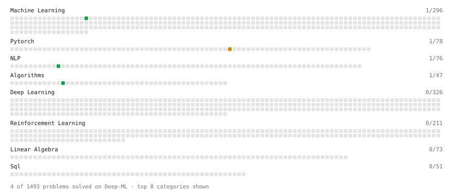

# Deep-ML

My machine learning practice from [Deep-ML](https://www.deep-ml.com). Every solution here was written by hand.

**5** solved · 4 problems · 1 labs · 0 math

[**Browse the interactive portfolio**](https://SemyaN1el.github.io/deep-ml/) to replay this filling in over time.

## Problems

| | Difficulty | Solved | |
| --- | --- | --- | --- |
| [Exact Match Score with Normalization](https://www.deep-ml.com/problems/325) | easy | 2026-10-01 | [solution](problems/0325-exact-match-score-with-normalization) |
| [Implement Ridge Regression Loss Function](https://www.deep-ml.com/problems/43) | easy | 2026-09-30 | [solution](problems/0043-implement-ridge-regression-loss-function) |
| [Top-K Largest Elements in a List](https://www.deep-ml.com/problems/1137) | easy | 2026-10-01 | [solution](problems/1137-top-k-largest-elements-in-a-list) |
| [SGD with Momentum Step](https://www.deep-ml.com/problems/1235) | medium | 2026-10-01 | [solution](problems/1235-sgd-with-momentum-step) |

## Labs

| | Difficulty | Solved | |
| --- | --- | --- | --- |
| [Fine-Tune DistilGPT2 on TinyStories](https://www.deep-ml.com/labs/29) | hard | 2026-10-01 | [solution](labs/0029-fine-tune-distilgpt2-on-tinystories) |

---

_This file is regenerated by Deep-ML on every push._
